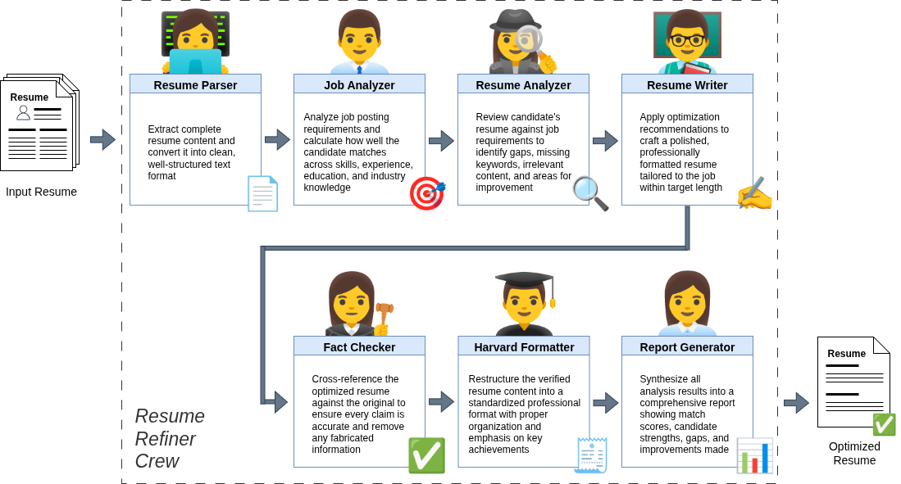

# Resume Refiner Crew

**AI-Powered Resume Optimization with Multi-Agent Intelligence**

An intelligent system that transforms your resume into a job-specific, ATS-optimized document using collaborative AI agents powered by CrewAI.

---

## Overview

Finding the right job is challenging, and getting past the initial screening is often the hardest part. **Applicant Tracking Systems (ATS)** are software tools used by over 75% of employers (and increasing) to automatically filter and rank resumes before a human ever sees them. If your resume isn't optimized for both ATS algorithms and the specific job description, it might never reach a hiring manager—even if you're qualified.

**Resume Refiner Crew** analyzes your resume and a target job description to automatically produce a tailored, ATS-friendly version of your CV. The system highlights the skills and achievements that matter most for that role, incorporates job-specific keywords, and removes irrelevant content to meet the ideal length—while always staying truthful and aligned to your original resume.

The result is a clean, professionally written resume with standardized structure and **Harvard-style PDF formatting**, making it easier for automated Applicant Tracking Systems to parse and score.


By ensuring your resume clearly matches what recruiters and ATS algorithms are looking for, you **dramatically increase your chances of passing the initial filter** and landing an interview—so your qualifications are actually seen by the people who make hiring decisions.

---

## Table of Contents
- [Overview](#overview)
- [Key Features](#key-features)
- [How It Works](#how-it-works)
- [Quick Start](#quick-start)
- [Setup & Configuration](#setup--configuration)
- [Local Installation and Usage](#local-installation-and-usage)
- [Docker Usage](#docker-usage)
- [User Guide](#user-guide)
- [Developer Mode](#developer-mode)
- [Project Structure](#project-structure)
- [Output Files](#output-files)
- [Technical Notes](#technical-notes)
- [Acknowledgments](#acknowledgments)
- [License](#license)

---

## Key Features

Resume Refiner Crew combines automation, AI collaboration, and professional formatting to deliver high-impact resumes. Key features include:

- **Intelligent Resume Parsing** - Automatically extracts content from PDF resumes into structured format
- **Job Fit Scoring** - Analyzes how well your background matches job requirements with weighted scoring (technical skills 35%, experience 25%, soft skills 20%, education 10%, industry 10%)
- **ATS Optimization** - Ensures your resume passes Applicant Tracking Systems with proper keywords and formatting
- **Fact-Checking** - Verifies all claims against your original resume to prevent AI hallucinations
- **Word Count Control** - Automatically adjusts resume length to fit single-page (400-600 words) or two-page (600-800 words) formats
- **Harvard Formatting** - Generates professional, clean resumes following Harvard Business School standards
- **PDF Output** - Produces publication-ready PDF resumes with LaTeX typesetting
- **Comprehensive Reports** - Creates detailed analysis reports with strengths, gaps, and improvement suggestions

---

## How It Works

Resume Refiner Crew leverages **Multi-Agent Systems (MAS)**, a branch of artificial intelligence where multiple specialized AI agents work cooperatively toward a shared goal. Instead of a single AI trying to handle everything, seven specialized agents collaborate—each with unique expertise—to transform your resume. This cooperative approach mirrors how expert teams work together: one agent parses documents, another analyzes job requirements, another optimizes content, and so on. The result is a professionally formatted resume that maximizes your chances of getting noticed.

This project uses a **sequential pipeline** of seven specialized AI agents that work together to transform your resume:



**Output:** A tailored, fact-checked, ATS-optimized resume, plus a detailed analysis report.

---

## Quick Start

You can use **Resume Refiner Crew** in three different ways, depending on your setup and preferences. 
All methods share the same workflow and *require an OpenAI API key*, you can generate one following the steps in the [Create OpenAI API Key](#create-openai-api-key) section.

### Option 1 — Online Demo (No Installation)

Try the system instantly through the hosted Streamlit app, without any installation:
**[Launch on Streamlit Community Cloud](https://swarm-resume-refiner.streamlit.app/)**
Upload your resume and job description directly in the browser and watch the agents work in real time.

### Option 2 — Local Installation

Run Resume Refiner Crew on your own machine for full control and faster execution.
You’ll need **Python 3.10+**, **LaTeX**, and an **OpenAI API key**.
Follow the steps in the [Setup & Configuration](#setup--configuration) and [Local Installation and usage](#local-installation-and-usage) sections to install dependencies, configure environment variables, and launch the web interface locally.

### Option 3 — Docker Deployment

Deploy the system in an isolated environment using Docker.
Either pull the pre-built image from Docker Hub or build it locally.
This option is ideal if you want a clean setup without installing Python or LaTeX manually.
Follow the steps in [Docker Usage](#docker-usage) if you prefer this method.

---

Once you’ve chosen your preferred method, the usage flow is the same, as described in the [User Guide](#user-guide) section:

1. Add your **job description** and **resume**
2. Wait for the **agents** to complete processing
3. Review, edit, and **download** your optimized resume

---

### Demo
Here is an example of an execution of the system:


---

## Setup & Configuration

### Create OpenAI API Key

This project requires an OpenAI API key to function. **Note: OpenAI API usage is a paid service** and you will be charged based on token consumption.

**Steps to create your API key:**

1. Visit [https://platform.openai.com/api-keys](https://platform.openai.com/api-keys)
2. Sign in to your OpenAI account (or create one if needed)
3. Click "Create new secret key"
4. Copy the generated API key (you won't be able to see it again)
5. Store it securely

**Important Notes:**
- You must have an OpenAI account with credits to use the API
- Monitor your usage at [https://platform.openai.com/usage](https://platform.openai.com/usage)
- **Disclaimer:** The author of this project takes no responsibility for any charges incurred through OpenAI API usage or any misuse of API keys. Users are solely responsible for managing their API keys securely and monitoring their usage costs.

### Set Up Environment Variables
> For users running the system through the hosted streamlit app, this step is not required

Copy the example environment file and add your API key:

```bash
cp .env.example .env
```

Edit the `.env` file:

```bash
# Required: Your OpenAI API key
OPENAI_API_KEY=your_openai_api_key_here

# Optional: Customize these settings
OPENAI_MODEL=gpt-5-mini                    # Default: gpt-5-mini
TARGET_RESUME_WORDS=500                     # Default: 500 (400-600 for 1 page, 600-800 for 2 pages)
DEVELOPER_MODE=false                        # Default: false (see Developer Mode section for details)
ENABLE_REPORTS=true                         # Default: true (enable/disable report generator agent)
ENABLE_FACT_CHECK=true                      # Default: true (enable/disable fact checker agent)
INCLUDE_SUMMARY=true                        # Default: true (include/exclude summary section in output)
DEFAULT_RESUME_LANGUAGE="Auto"              # Default: Auto (Auto, English, Spanish)
SHOW_API_CONFIG_UI=true                     # Default: true (show/hide API key input in UI)
```

---

## Local Installation and Usage

### Prerequisites

Before installing, ensure you have the following:

- **Python** 3.10 or higher
- **LaTeX Distribution** (for PDF generation)
  - Ubuntu/Debian: `sudo apt-get install texlive-latex-base texlive-latex-extra`
  - macOS: `brew install --cask mactex`
  - Windows: Install [MiKTeX](https://miktex.org/) or [TeX Live](https://www.tug.org/texlive/)
- **Pandoc** (for DOCX generation)
  - Ubuntu/Debian: `sudo apt-get install pandoc`
  - macOS: `brew install pandoc`
  - Windows: Download from [pandoc.org](https://pandoc.org/installing.html)

### 1. Clone the Repository

```bash
git clone https://github.com/marcoom/resume-refiner-crew.git
cd resume-refiner-crew
```

### 2. Create Virtual Environment

It is recommended to create a virtual environment:

```bash
python -m venv .venv
```

Activate the virtual environment:

```bash
source .venv/bin/activate  # On Linux/Mac
# or
.venv\Scripts\activate     # On Windows
```

### 3. Install UV Package Manager
This project uses [UV](https://docs.astral.sh/uv/) for fast, reliable dependency management. Install it:

```bash
pip install uv
```

### 4. Install Dependencies

```bash
uv pip install -e .
```

This command installs the project and all dependencies defined in `pyproject.toml` using UV's fast resolver.

### 5. Execute the system

Resume Refiner Crew can be used in two ways: **Web UI** (recommended for most users) or **Command Line**.

#### Web Interface (Recommended)

The easiest way to use Resume Refiner Crew is through the Streamlit web interface. Start it with:

```bash
./start.sh
```

The web interface will open in your browser at `http://localhost:8501`.

From there, you can follow the steps in [User Guide](#user-guide) section.


#### Command Line Interface

For automation or integration into workflows, use the CLI:

```bash
crewai run
```

**Before running**, ensure your input files are in place:
- Resume PDF: `knowledge/CV.pdf`
- Job Description: `knowledge/job_description.txt`

This command will kickoff a crew execution, and the resulting files will be provided at the `output` folder.

---

## Docker Usage

Resume Refiner Crew is available as a Docker container, providing an isolated environment with all dependencies pre-installed. This is the easiest way to run the application without manually installing Python, LaTeX, or other dependencies.

### Prerequisites

- **Docker** or **Docker Desktop** installed on your system
  - Linux: [Install Docker Engine](https://docs.docker.com/engine/install/)
  - macOS: [Install Docker Desktop](https://docs.docker.com/desktop/install/mac-install/)
  - Windows: [Install Docker Desktop](https://docs.docker.com/desktop/install/windows-install/)

### Using Pre-built Image from Docker Hub

The easiest way to get started is to pull the pre-built image from Docker Hub:

```bash
docker pull marcoom/swarm-resume-refiner:1.0.0
```

Run the container with environment variables:

```bash
docker run -p 8501:8501 \
  -e OPENAI_API_KEY=your_openai_api_key_here \
  -e OPENAI_MODEL=gpt-5-mini \
  -e TARGET_RESUME_WORDS=500 \
  -e DEVELOPER_MODE=false \
  -e ENABLE_REPORTS=true \
  -e ENABLE_FACT_CHECK=true \
  -e SHOW_API_CONFIG_UI=true \
  marcoom/swarm-resume-refiner:1.0.0
```

**Environment Variables Explained:**
- `OPENAI_API_KEY` - **(Required)** Your OpenAI API key
- `OPENAI_MODEL` - *(Optional)* Model to use (default: `gpt-5-mini`)
- `TARGET_RESUME_WORDS` - *(Optional)* Target word count (default: `500`; single page: 400-600, two pages: 600-800)
- `DEVELOPER_MODE` - *(Optional)* Set to `true` to simulate execution without API calls (default: `false`)
- `ENABLE_REPORTS` - *(Optional)* Set to `false` to disable the report generator agent (default: `true`)
- `ENABLE_FACT_CHECK` - *(Optional)* Set to `false` to disable the fact checker agent (default: `true`)
- `INCLUDE_SUMMARY` - *(Optional)* Set to `false` to exclude the summary section from output (default: `true`)
- `DEFAULT_RESUME_LANGUAGE` - *(Optional)* Default language for resume generation. Options: "Auto", "English", "Spanish" (default: `Auto`)
- `SHOW_API_CONFIG_UI` - *(Optional)* Set to `false` to hide the API Key input in the UI (default: `true`)

**On Windows (PowerShell)**, use `${PWD}` instead of `$(pwd)`:

```powershell
docker run -p 8501:8501 `
  -e OPENAI_API_KEY=your_openai_api_key_here `
  -e OPENAI_MODEL=gpt-5-mini `
  -e TARGET_RESUME_WORDS=500 `
  -e DEVELOPER_MODE=false `
  marcoom/swarm-resume-refiner:1.0.0
```

**Using an environment file** (recommended for managing multiple variables):

```bash
# Copy .env.example and edit with your configuration
cp .env.example .env
# Then edit .env and add your OpenAI API key

# Run with --env-file
docker run -p 8501:8501 \
  --env-file .env \
  marcoom/swarm-resume-refiner:1.0.0
```

The Streamlit web interface will be available at `http://localhost:8501`.

From here, you can follow the steps in the [User Guide](#user-guide) section.

### Building and Running Locally

If you prefer to build the Docker image from source, instead of downloading from DockerHub:

#### 1. Build the Image

```bash
docker build -t swarm-resume-refiner .
```

#### 2. Run the Container

```bash
docker run -p 8501:8501 \
  -e OPENAI_API_KEY=your_openai_api_key_here \
  -e OPENAI_MODEL=gpt-5-mini \
  -e TARGET_RESUME_WORDS=500 \
  -e DEVELOPER_MODE=false \
  swarm-resume-refiner
```

Or use an environment file:

```bash
docker run -p 8501:8501 \
  --env-file .env \
  swarm-resume-refiner
```

From here, you can follow the steps in the [User Guide](#user-guide) section.

---

## User Guide

> You need an OpenAI API Key to run the Crew, see Configuration section for steps on how to create it, if you don't have one already

### 1. Add the Inputs

Provide the job description, upload your resume, and configure the execution settings.


**Steps:**

1. **Job Description**: Paste the full job posting into the sidebar field. Formatting does not matter—plain, unstructured text works perfectly.

2. **Resume PDF**: Upload your resume in PDF format (required). Single-column layouts ensure the best parsing accuracy, but multi-column or visually complex designs are also supported. Make sure your resume is up to date and includes all relevant information—the system reorganizes and optimizes what is already there.

3. **Execution Options**

   * **OpenAI API Key** – Paste your key to enable agent execution.
   * **Model Selection** – Choose from OpenAI GPT models based on your quality and cost preferences. Larger models generally produce better results but are more expensive. Current recommended models for strong performance are gpt-5 and gpt-5-mini, though this may evolve as new models are released. Pricing details: https://platform.openai.com/docs/pricing
   * **Target Word Count** – Guides output length (e.g., ~500 words typically results in a two-page resume).

4. **Run the Process**: Click **Process Resume** to start the multi-agent pipeline and generate your optimized resume.

This will provide all the required inputs and kickoff the crew execution that will process the optimized resume.

> Note: sometimes when the target resume words is set too high, the agents drift and hallucinate untrue facts, which are not picked by the fact-checker agent. If this happens to you, try using a bigger model, or lowering the target number of words.


### 2. Wait for the Agents to Complete
The optimization process typically takes around 8 minutes (bigger models tend to be slower). During this phase, the multi-agent system analyzes and transforms your resume. You can monitor real-time progress, including which agent is currently working, execution status, elapsed time, and detailed activity logs.

Go grab a cup of coffee ☕


### 3. Review and Download Your Optimized Resume

After processing completes, you can review the results, refine content if needed, and download all generated files.


Here you can:

* **View the Executive Summary Report**
  A clear breakdown of:

  * Overall job match score and weighted sub-scores
  * Key strengths and improvement areas
  * Optimization decisions applied to your resume
  * ATS-relevant keywords incorporated into the final version

* **Refine Your Tailored Resume (Optional)**
  Edit the structured resume content in JSON format directly in the UI.
  Apply your changes with one click—or restore the original version generated by the agents.

* **Download All Output Files**
  Get your optimized resume in **PDF** and **DOCX** formats, plus supporting artifacts for full transparency. 
  Filename follows this format: `CV_[LastName]_[FirstName]_[JobTitle].pdf` (and `.docx`), where your name and filename are automatically obtained from the input resume, and the job title from the job description.

To start the process again with new inputs, click **Start Over** in the sidebar.

  > Note: the provided editor allows to edit every field in the resume, but if you need to perform major modifications, it may be easier to do it elsewhere (as LaTeX editing can become tedious). For that purpose, if you download all artifacts, both a **.tex** file and a **.docx** file are provided. The .tex file can be opened in any LaTeX editor such as [Overleaf](https://www.overleaf.com/), while the .docx file can be opened in Microsoft Word or any compatible word processor for easy editing without needing to learn LaTeX.

---

## Developer Mode

**Developer Mode** allows you to test the application's UI and workflows without running the actual multi-agent system. This is particularly useful during development when you want to:

- Test changes to the Streamlit interface without waiting for agents to complete (crew execution will take about 13 seconds instead of 5+ minutes)
- Iterate quickly on UI improvements without incurring API costs
- Validate the flow from processing to results display
- Test with consistent, known output data

### How It Works

When `DEVELOPER_MODE=true`, the system:

1. **Skips crew execution** - No agents are run, no API calls are made
2. **Simulates logs** - Writes realistic log messages to `.crewai_temp/crew_logs.txt` with 1-second delays between entries
3. **Uses fixture files** - Copies pre-generated output files from `tests/fixtures/output/` to `output/`
4. **Maintains normal flow** - All other parts of the system (PDF generation, file downloads, UI components) work exactly as they would with real execution

---

## Project Structure

```
resume-refiner-crew/
│
├── src/resume_refiner_crew/
│   ├── config/
│   │   ├── agents.yaml              # Agent definitions (roles, goals, backstories)
│   │   └── tasks.yaml               # Task definitions with descriptions and expected outputs
│   │
│   ├── tools/
│   │   ├── word_counter_tool.py     # Tool for iterative word count validation
│   │   └── latex_generator.py       # LaTeX generation and PDF compilation
│   │
│   ├── constants.py                 # Application constants and configuration
│   ├── crew.py                      # Crew orchestration, agent/task initialization
│   ├── main.py                      # Entry point, pipeline execution (CLI)
│   ├── models.py                    # Pydantic models (JobRequirements, ResumeOptimization, etc.)
│   ├── streamlit_runner.py          # Wrapper for running crew with custom parameters (Web UI)
│   ├── utils.py                     # Utility functions (storage cleanup)
│   └── validation.py                # Input validation functions
│
├── tests/
│   └── fixtures/                    # Test fixtures for developer mode
│       ├── knowledge/               # Sample input files for testing
│       └── output/                  # Sample output files for testing
│
├── knowledge/                       # Folder to upload input (CLI Usage only)
│   ├── CV.pdf                       # Input resume
│   └── job_description.txt          # Target job posting (plain text)
│
├── output/                          # All generated files go here
│   ├── parsed_resume.md             # Original resume in markdown
│   ├── job_analysis.json            # Job requirements and scoring
│   ├── resume_optimization.json     # Optimization suggestions
│   ├── optimized_resume.md          # Tailored resume (markdown)
│   ├── verified_resume.md           # Fact-checked resume
│   ├── structured_resume.json       # Harvard-formatted data
│   ├── final_report.md              # Comprehensive analysis report
│   └── CV_[LastName]_[FirstName]_[JobTitle].pdf  # Final PDF resume
│
├── templates/                       # LaTeX templates
│   ├── harvard_resume.tex           # Main Harvard-style resume template
│   └── harvard_resume_pandoc.tex    # Alternative Pandoc-compatible template
│
├── media/                           # Documentation images and diagrams
│
├── streamlit_app.py                 # Streamlit web interface
├── start.sh                         # Launch script for web UI
├── Dockerfile                       # Docker container configuration
├── .env                             # Environment configuration (not in git)
├── .env.example                     # Example environment configuration
├── pyproject.toml                   # Project dependencies and metadata
├── uv.lock                          # UV package manager lock file
├── LICENSE                          # MIT License
└── README.md                        # This file
```

---

## Output Files

After running the pipeline, you'll find these files in the `output/` directory:

| File | Description |
|------|-------------|
| `parsed_resume.md` | Your original resume converted from PDF to markdown format |
| `job_analysis.json` | Structured analysis of job requirements with candidate scoring |
| `resume_optimization.json` | Detailed optimization suggestions with before/after examples |
| `optimized_resume.md` | Your resume with optimizations applied (markdown) |
| `verified_resume.md` | Fact-checked version with hallucinations removed |
| `structured_resume.json` | Harvard-formatted structured data ready for PDF generation |
| `final_report.md` | Comprehensive report with job fit analysis and recommendations |
| `CV_[LastName]_[FirstName]_[JobTitle].pdf` | **Final PDF resume** ready to submit |
| `CV_[LastName]_[FirstName]_[JobTitle].docx` | **Final DOCX resume** for easy editing in Word |
| `CV_[LastName]_[FirstName]_[JobTitle].tex` | LaTeX source file for advanced customization |

---

## Technical Notes

### Why Not Use Local Open-Source LLMs?

During development, I attempted to run this system using local open-source language models on consumer-grade GPU hardware. Unfortunately, the results were unsatisfactory for several reasons:

- **Model Size Constraints:** To fit within consumer GPU memory (typically 8-12GB VRAM), only smaller models could be used. These models lack the sophisticated reasoning capabilities needed for complex tasks like resume optimization.
- **Poor Prompt Following:** Smaller models struggled to follow detailed instructions, often deviating from the structured output format required by the pipeline.
- **Inconsistent Quality:** The agents would frequently miss important details, hallucinate information, or produce inconsistently formatted outputs.

For these reasons, **an OpenAI API key is required** to use this system. OpenAI's models (like GPT-4 and GPT-5) provide the reliability, instruction-following capability, and reasoning power necessary for high-quality resume optimization.

As open-source models continue to improve, local LLM support may become viable in future versions.

---

## Acknowledgments

This project was inspired by and built upon excellent resources from the CrewAI community:

- **CrewAI YouTube Tutorial** by Tony Kipkemboi: [Resume Optimization with CrewAI](https://www.youtube.com/watch?v=ppE1CXhRNF8)
  Original repository: [https://github.com/tonykipkemboi/resume-optimization-crew](https://github.com/tonykipkemboi/resume-optimization-crew)

- **Multi AI Agent Systems with CrewAI** - Free course by CrewAI and DeepLearning.AI:
  [https://www.deeplearning.ai/short-courses/multi-ai-agent-systems-with-crewai/](https://www.deeplearning.ai/short-courses/multi-ai-agent-systems-with-crewai/)

Special thanks to the CrewAI team for creating an excellent framework for building multi-agent AI systems.

---

## License

This project is licensed under the **MIT License**.

See the [LICENSE](LICENSE) file for full license text.
